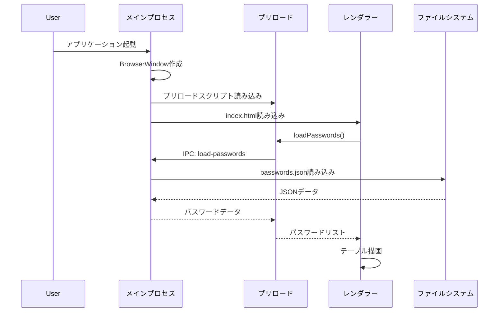
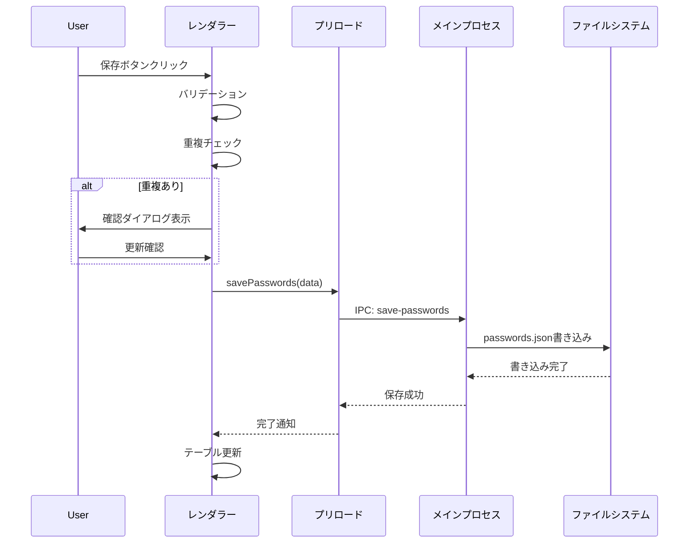

# パスワード管理アプリケーション 基本設計書

## 1. システム概要

### 1.1 システム名
パスワード管理アプリケーション

### 1.2 目的
ユーザーのパスワード情報を安全にローカル環境で管理し、簡単に検索・編集・コピーできるデスクトップアプリケーションを提供する。

### 1.3 主要機能
- パスワード情報の登録・編集・削除
- パスワードの自動生成
- 検索機能によるエントリの絞り込み
- クリップボードへのコピー機能
- テーマ切り替え（ライト/ダーク）
- データのローカル保存

## 2. システムアーキテクチャ

### 2.1 アーキテクチャ概要
本システムは、Electronフレームワークを基盤とした3層アーキテクチャで構成される。

```
┌─────────────────────────────────────────────────────────┐
│                    レンダラープロセス                      │
│  ┌──────────────────────────────────────────────────┐  │
│  │              プレゼンテーション層                  │  │
│  │   ・HTML/CSS によるUI                             │  │
│  │   ・モーダルダイアログ                            │  │
│  │   ・テーブル表示                                  │  │
│  └──────────────────────────────────────────────────┘  │
│  ┌──────────────────────────────────────────────────┐  │
│  │              ビジネスロジック層                    │  │
│  │   ・app.js (メインコントローラー)                 │  │
│  │   ・各種マネージャークラス                        │  │
│  │   ・ユーティリティモジュール                      │  │
│  └──────────────────────────────────────────────────┘  │
└─────────────────────────────────────────────────────────┘
                            │
                  Context Bridge API
                            │
┌─────────────────────────────────────────────────────────┐
│                    メインプロセス                         │
│  ┌──────────────────────────────────────────────────┐  │
│  │              データアクセス層                      │  │
│  │   ・ファイルシステムへのアクセス                  │  │
│  │   ・passwords.json の読み書き                     │  │
│  │   ・外部リンク・フォルダーアクセス                │  │
│  └──────────────────────────────────────────────────┘  │
└─────────────────────────────────────────────────────────┘
```

### 2.2 プロセス間通信
- **Context Isolation**: 有効
- **Node Integration**: 無効
- **通信方式**: contextBridge APIを介したIPC通信

## 3. 各層の詳細設計

### 3.1 メインプロセス層

#### 3.1.1 main.js
**責務**: アプリケーションのライフサイクル管理とウィンドウ制御

**主要機能**:
- BrowserWindowの作成と管理
- IPCハンドラーの登録
- ファイルシステムアクセス

**セキュリティ設定**:
```javascript
webPreferences: {
  preload: path.join(__dirname, 'preload.js'),
  contextIsolation: true,
  enableRemoteModule: false,
  nodeIntegration: false
}
```

#### 3.1.2 preload.js
**責務**: メインプロセスとレンダラープロセス間の安全なブリッジ

**公開API**:
| API名 | 機能 | 引数 | 戻り値 |
|-------|------|------|--------|
| loadPasswords | パスワードデータ読み込み | なし | Promise<Password[]> |
| savePasswords | パスワードデータ保存 | passwords: Password[] | Promise<void> |
| openPasswordFolder | 保存フォルダーを開く | なし | Promise<void> |
| openUrl | URLをブラウザで開く | url: string | Promise<void> |
| copyToClipboard | クリップボードコピー | text: string | Promise<void> |

### 3.2 レンダラープロセス層

#### 3.2.1 プレゼンテーション層

**構成要素**:
- **index.html**: アプリケーションのメインUI
- **CSSモジュール**:
  - base.css: 基本スタイル定義
  - components.css: UIコンポーネントスタイル
  - modal.css: モーダルダイアログスタイル
  - table.css: テーブルスタイル
  - themes.css: テーマ定義
  - tooltip.css: ツールチップスタイル

**モーダルダイアログ**:
1. 編集モーダル（新規/編集）
2. 詳細表示モーダル
3. 設定モーダル

#### 3.2.2 ビジネスロジック層

**モジュール構成**:

```
src/assets/js/
├── app.js              # メインコントローラー
├── components/
│   ├── modal.js        # モーダル管理
│   ├── search.js       # 検索機能
│   ├── table.js        # テーブル管理
│   └── theme.js        # テーマ管理
└── utils/
    ├── dom.js          # DOM操作ユーティリティ
    ├── password.js     # パスワード生成・操作
    └── storage.js      # データ永続化
```

**主要クラス/モジュール**:

1. **app.js**
   - アプリケーション全体の制御
   - 各マネージャーの初期化と連携
   - イベントハンドリング

2. **ModalManager** (modal.js)
   - モーダルダイアログの表示/非表示
   - フォームデータの管理
   - バリデーション処理

3. **TableManager** (table.js)
   - テーブルの描画と更新
   - ソート機能
   - フィルタリング連携

4. **SearchManager** (search.js)
   - リアルタイム検索
   - 複数フィールド対応

5. **ThemeManager** (theme.js)
   - テーマの切り替え
   - ユーザー設定の保存

## 4. データ設計

### 4.1 データモデル

**パスワードエントリ**:
```typescript
interface PasswordEntry {
  id: string;           // ユニークID（UUID）
  title: string;        // エントリ名
  username: string;     // ユーザー名
  password: string;     // パスワード
  url: string;          // URL（オプション）
  notes: string;        // 備考（オプション）
  createdAt: string;    // 作成日時（ISO 8601）
  updatedAt: string;    // 更新日時（ISO 8601）
}
```

### 4.2 データ保存形式

**ファイル形式**: JSON
**保存場所**: `%APPDATA%/20250625_0152/passwords.json`

**ファイル構造**:
```json
{
  "passwords": [
    {
      "id": "550e8400-e29b-41d4-a716-446655440000",
      "title": "サンプルエントリ",
      "username": "user@example.com",
      "password": "encrypted_password",
      "url": "https://example.com",
      "notes": "備考テキスト",
      "createdAt": "2024-01-01T00:00:00.000Z",
      "updatedAt": "2024-01-01T00:00:00.000Z"
    }
  ]
}
```

## 5. 画面設計

### 5.1 メイン画面

```
┌─────────────────────────────────────────────────────┐
│ パスワード管理                              [🌙] [⚙] │
├─────────────────────────────────────────────────────┤
│ [🔍 検索...]                          [+ 新規追加]   │
├─────────────────────────────────────────────────────┤
│ エントリ ▼ │ ユーザー名 │ 更新日時 ▼ │ 操作      │
├─────────────────────────────────────────────────────┤
│ Gmail      │ user@...   │ 2024/01/01 │ [👁][📋][✏]│
│ GitHub     │ username   │ 2024/01/01 │ [👁][📋][✏]│
└─────────────────────────────────────────────────────┘
```

### 5.2 編集モーダル

```
┌─────────────────────────────────────────────────────┐
│              新規パスワード追加              [×]     │
├─────────────────────────────────────────────────────┤
│ エントリ名:     [___________________]              │
│ ユーザー名:     [___________________]              │
│ パスワード:     [___________________] [👁] [🎲]    │
│ URL:           [___________________]              │
│ 備考:                                              │
│ [_____________________________________________]    │
│ [_____________________________________________]    │
│                                                    │
│                      [キャンセル] [保存/更新]       │
└─────────────────────────────────────────────────────┘
```

## 6. 処理フロー

### 6.1 アプリケーション起動フロー



### 6.2 パスワード保存フロー



## 7. セキュリティ設計

### 7.1 セキュリティ対策

1. **プロセス分離**
   - Context Isolationを有効化
   - Node.js APIへの直接アクセスを禁止

2. **CSP（Content Security Policy）**
   - 外部スクリプトの実行を禁止
   - インラインスタイルのみ許可

3. **API制限**
   - 必要最小限のAPIのみ公開
   - ファイルアクセスはメインプロセスに限定

4. **データ保護**
   - ローカルファイルシステムに保存
   - 将来的な暗号化実装を考慮した設計

### 7.2 将来的なセキュリティ強化案

1. パスワードデータの暗号化
2. マスターパスワードによる保護
3. 自動ロック機能
4. セキュアな乱数生成器の使用

## 8. 性能設計

### 8.1 性能目標

- アプリケーション起動時間: 3秒以内
- パスワード検索レスポンス: 100ms以内
- 1000件のエントリ処理が可能

### 8.2 最適化手法

1. **仮想スクロール**（将来実装）
   - 大量データ表示時のパフォーマンス向上

2. **検索の最適化**
   - デバウンス処理による検索頻度の制御
   - インクリメンタルサーチ

3. **メモリ管理**
   - 不要なDOMノードの削除
   - イベントリスナーの適切な解除

## 9. エラー処理

### 9.1 エラー処理方針

1. **ユーザーフレンドリーなエラーメッセージ**
   - 技術的な詳細を隠蔽
   - 解決方法の提示

2. **グレースフルデグラデーション**
   - エラー時も基本機能は維持
   - データロスの防止

3. **ログ記録**
   - 開発モードでのコンソールログ
   - エラーの詳細情報記録

## 10. 拡張性

### 10.1 将来の拡張計画

1. **機能拡張**
   - カテゴリー/タグ機能
   - パスワード強度チェッカー
   - 定期的なパスワード変更リマインダー
   - インポート/エクスポート機能

2. **プラットフォーム拡張**
   - macOS/Linux対応
   - モバイル連携

3. **セキュリティ強化**
   - 生体認証対応
   - 二要素認証

### 10.2 モジュール設計の拡張性

- ES6モジュールによる機能分離
- 疎結合な設計
- インターフェースベースの実装

## 11. テスト設計

### 11.1 テスト戦略

1. **単体テスト**
   - Jestフレームワーク使用
   - ユーティリティ関数のテスト
   - データ管理ロジックのテスト

2. **統合テスト**
   - Electron APIのモック
   - レンダラープロセスのテスト

3. **E2Eテスト**（将来実装）
   - Spectronによる自動化テスト

### 11.2 テストカバレッジ目標

- ユーティリティ関数: 100%
- ビジネスロジック: 80%以上
- UI操作: 主要パスの網羅

## 12. デプロイメント

### 12.1 ビルド設定

**Electron Forge設定**:
- Windows向けSquirrelインストーラー
- アプリケーションアイコン設定
- 自動アップデート対応（将来実装）

### 12.2 配布方法

1. **Windows**
   - .exeインストーラー
   - ポータブル版（将来対応）

2. **配布チャネル**
   - GitHubリリース
   - 公式ウェブサイト（将来対応）

## 13. 運用・保守

### 13.1 ログ管理

- 開発モード: コンソールログ出力
- 本番モード: エラーログのみ記録

### 13.2 アップデート戦略

1. **セマンティックバージョニング**
   - メジャー: 破壊的変更
   - マイナー: 機能追加
   - パッチ: バグ修正

2. **リリースサイクル**
   - 月次でのマイナーリリース
   - 必要に応じたパッチリリース

## 14. 開発環境

### 14.1 必要環境

- Node.js: v18以上
- npm: v9以上
- OS: Windows 10/11（開発）、WSL（コード編集）

### 14.2 開発ツール

- エディタ: 任意
- デバッガー: Chrome DevTools
- テストランナー: Jest
- ビルドツール: Electron Forge

## 15. 参考資料

- [Electron公式ドキュメント](https://www.electronjs.org/docs)
- [Electron セキュリティガイドライン](https://www.electronjs.org/docs/latest/tutorial/security)
- [Jest ドキュメント](https://jestjs.io/docs/getting-started)